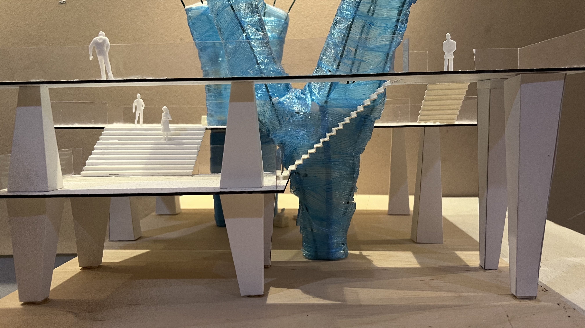
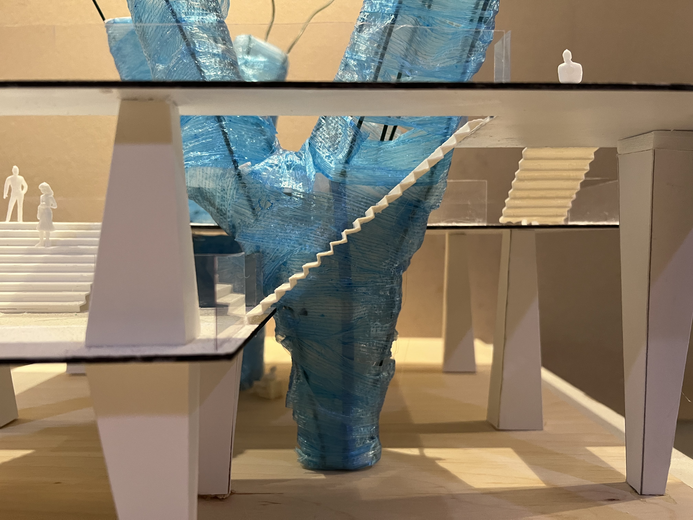
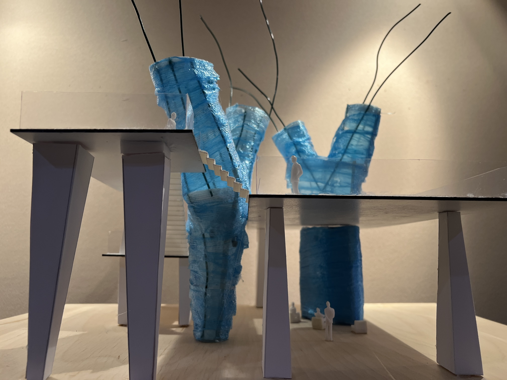
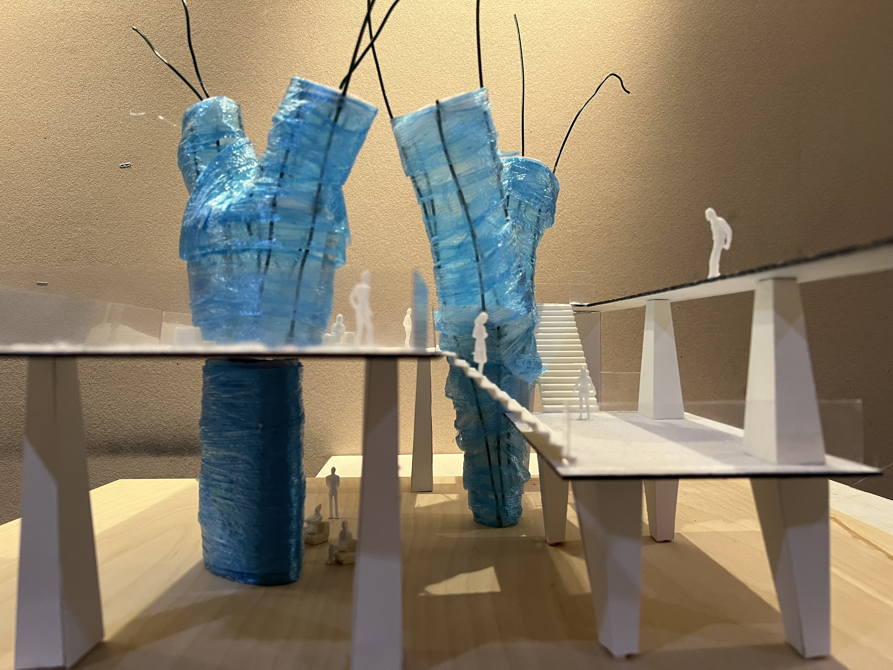

# Partial model photos
## Aquaculture with Rainwater pumping station
<!--  -->
<!-- <figure class="thrid">
  
  
  
  
  
  
</figure> -->

 

 |
--- | --- | 

 |
--- | --- | 

 

 
  Project from Interior Architecture Studio 2 (Fall 2023)  
  Yoomin Lee

